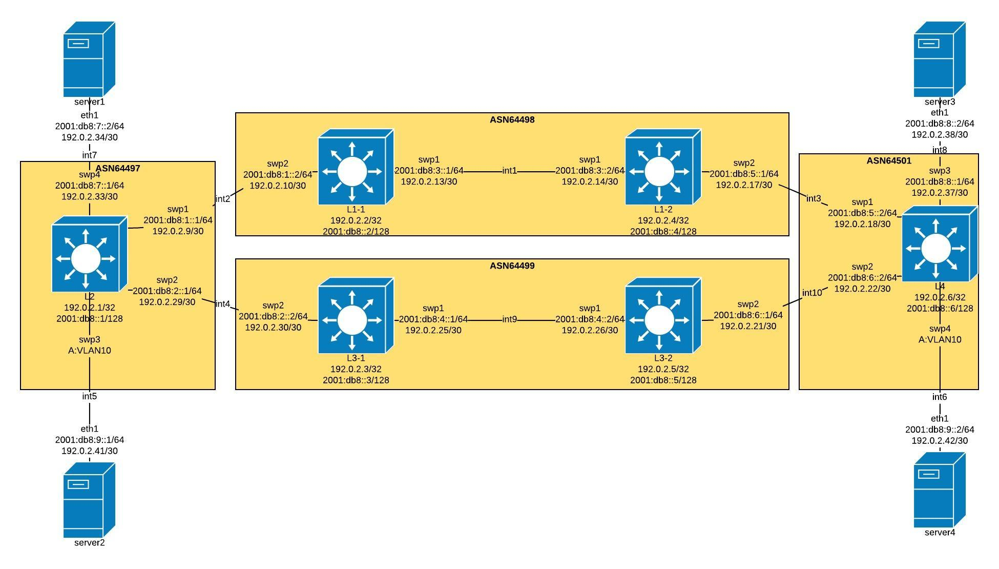

# Traffic Engineering in a box - BGP

Copyright 2019 SouthernHill and contributors. https://southernhill.nl

Licensed under the Apache License, Version 2.0 (the "License"); you may not use this file except in compliance with the License. You may obtain a copy of the License at

http://www.apache.org/licenses/LICENSE-2.0

This project allows you to deploy a BGP EVPN topology containing multiple eBGP and iBGP
peering relationships. The diversity this creates enables you to prototype several traffic
engineering policies. For the configuration we used documentation ASNs and prefixes as depicted below.

* 64496-64511 [RFC5398](https://tools.ietf.org/html/rfc5398) - [IANA](https://www.iana.org/assignments/as-numbers/as-numbers.xhtml)
* 192.0.2.0/24 [RFC5737](https://tools.ietf.org/html/rfc5737) - [IANA](https://www.iana.org/assignments/ipv4-address-space/ipv4-address-space.xhtml)
* 2001:db8::/32 [RFC3849](https://tools.ietf.org/html/rfc3849) - [IANA](https://www.iana.org/assignments/ipv6-address-space/ipv6-address-space.xhtml)

## Topology

The image below visualises the topology.

## Usage

Make sure that you have VirtualBox (used as provider) and Vagrant installed on your machine.
Afterwards you can easily bring up the topology by executing the `vagrant up` command.
Note that all commands should be executed in the same directory as the VagrantFile.

To open an SSH connection to L2 just use `vagrant ssh l2` and
you're in! To break down the topology afterwards issue the `vagrant destroy -f` command.

## Limitations

This topology currently has the following limitations:

* Doesn't work on Windows. The reason for this is because Ansible doesn't support Windows as a control machine[[1]](https://docs.ansible.com/ansible/latest/installation_guide/intro_installation.html#id11)
